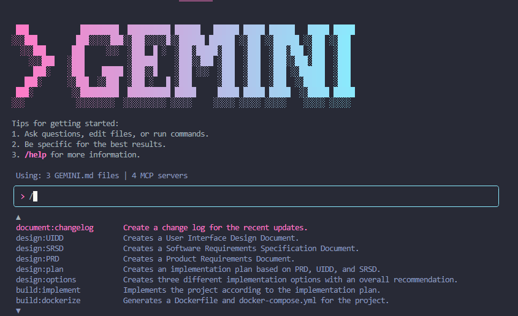

<p align="center">
  <a href="https://github.com/DochertyDev/Gemini-CLI-Custom-Commands">
    
  </a>
</p>

<h1 align="center">
Gemini CLI Custom Commands
</h1>

<h2 align="center">Streamline your development workflows with powerful, pre-defined prompts.</h2>

<div align="center">

[](LICENSE) [](https://github.com/DochertyDev/Gemini-CLI-Custom-Commands)

</div>

:star: _Love Gemini CLI Custom Commands? Give us a star to help other developers discover it!_

<br />

<div>

</div>

---

## 📋 Table of Contents

- [Overview](#-overview)
  - [Features](#features)
- [Quick Start](#-quick-start-local-development)
  - [Prerequisites](#prerequisites)
  - [Setup Instructions](#setup-instructions)
- [Usage](#️-usage)
- [Technologies Used](#️-technologies-used)
- [Security Notes](#-security-notes)
- [Troubleshooting](#-troubleshooting)
- [Contributing](#-contributing)
- [Support the Project](#-support-the-project)
- [Disclaimer](#️-disclaimer)

## 📄 Overview

This repository offers a collection of custom slash commands designed to extend the functionality of the Gemini CLI. These commands provide pre-defined prompts and instructions for the Gemini model, enabling users to automate and streamline common development tasks across various domains like build processes, design documentation, code analysis, debugging, and visualization. It aims to enhance productivity by encapsulating complex multi-step operations into simple, executable commands.

### Features

-   **Build Commands:** Automate Dockerfile generation and implementation plans.
-   **Design Commands:** Generate comprehensive design documents (PRD, SRSD, UIDD) and implementation plans.
-   **Document Commands:** Create changelogs, performance analyses, and security reports.
-   **Fix Commands:** Investigate and resolve errors, and heal UI issues.
-   **Visualize Commands:** Generate architectural, data model, and tech stack diagrams.

## 🚀 Quick Start (Local Development)

This project provides custom commands for the Gemini CLI. No build process is required for the commands themselves, but the Gemini CLI must be installed and configured.

### Prerequisites

-   **Node.js:** Version 18+ (Version 20+ is recommended).
-   **Gemini CLI:** You can install it via npm. For installation instructions, please refer to the [official Gemini CLI documentation](https://geminicli.com/docs/).

### Setup Instructions

1. Clone the repository:

    ```sh
    git clone https://github.com/DochertyDev/Gemini-CLI-Custom-Commands.git
    ```

2. Navigate to the project directory:

    ```sh
    cd Gemini-CLI-Custom-Commands
    ```

3. Copy the `.toml` files from the `commands/` directory into your Gemini CLI's commands folder. You can choose between global or project-specific installation:

    -   **Global Installation (Recommended):**
        ```bash
        mkdir -p ~/.gemini/commands
        cp -R commands/* ~/.gemini/commands/
        ```
    -   **Project-Specific Installation:**
        ```bash
        mkdir -p .gemini/commands
        cp -R commands/* .gemini/commands/
        ```

## ⚙️ Usage

Once installed, you can invoke the custom commands directly within the Gemini CLI.

1. **Open your terminal or command prompt.**
2. **Type a slash (`/`) followed by the command name.** Commands are organized by category and use a colon (`:`) separator. For example:
    ```bash
    /build:dockerize
    ```
3. **Follow any prompts or provide arguments** as required by the specific command. For example, some commands might accept additional arguments via the `{{args}}` placeholder in their `prompt` definition.

## 🛠️ Technologies Used

-   **TOML:** Used for defining the structure and content of each custom command.
-   **Gemini CLI:** The core command-line interface that executes these custom commands.
-   **Node.js:** The runtime environment for the Gemini CLI.
-   **Markdown:** Used for project documentation, including this README.

## 🔒 Security Notes

-   **Prompt Content:** Custom commands execute prompts directly to the Gemini model. Users should ensure that the content of these prompts, especially when including user-provided arguments, does not contain sensitive or confidential information.
-   **Local Operation:** These commands operate locally within your Gemini CLI environment and do not inherently transmit data externally unless explicitly configured within a command's prompt (e.g., if a prompt instructs Gemini to interact with an external API).
-   **Review `.toml` Files:** It is highly recommended that users review the content of all `.toml` command definition files before use to understand the exact instructions and data being sent to the Gemini model. This ensures transparency and helps prevent unintended actions.

## ❓ Troubleshooting

**Issue**: Commands not recognized by the Gemini CLI.
-   **Solution**: Verify that the `.toml` files have been correctly copied to the appropriate Gemini CLI commands directory (`~/.gemini/commands` for global or `.gemini/commands` for project-specific). Ensure the Gemini CLI is installed and accessible in your system's PATH.

**Issue**: Gemini CLI is not installed or not functioning correctly.
-   **Solution**: Refer to the [official Gemini CLI documentation](https://geminicli.com/docs/) for detailed installation instructions and troubleshooting guides for the CLI itself.

## 🤝 Contributing

<div align="center">
<a href="https://github.com/DochertyDev/Gemini-CLI-Custom-Commands/graphs/contributors">
  
</a>
</div>

We welcome contributions from the community! If you have suggestions for improvements or new features, feel free to open an issue or submit a pull request. Please ensure any new commands adhere to the `.toml` structure and are placed in the appropriate category within the `commands/` directory.

## 🌟 Support the Project

**Love Gemini CLI Custom Commands?** Give us a ⭐ on GitHub!

<div align="center">
  <p>
      
  </p>
</div>

## ⚠️ Disclaimer

This project provides custom commands for Gemini CLI. While these commands are designed to streamline development workflows, users are solely responsible for reviewing and understanding the prompts and instructions executed by these commands. Use at your own discretion. The developers are not responsible for any outcomes resulting from the use of these commands.
